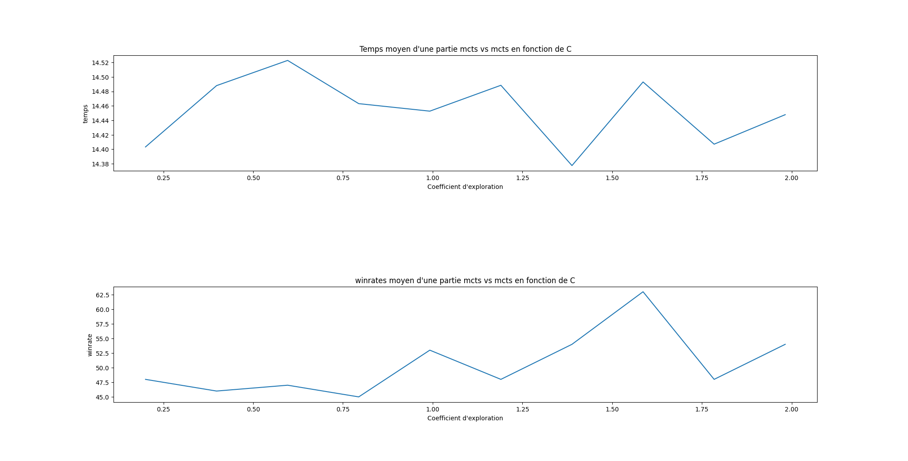
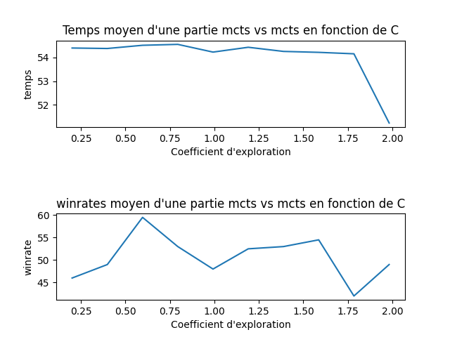

# AI-Jeux
Le projet est codé avec python 3.10.
Matériel de travail: 
    CPU : Rayson 5, 12 coeurs logiques
    GPU : 

# IA random

### IARand vs IARand (Non parallélisé)
    IARand0: 50.8953 
    IARand1: 49.1047
    time: 5.985922574996948
    nbsim/s: 167058.62587948857

### IA100P vs IARand
##### Non parallélisé
    IA100P: 100.0 
    IARand: 0.0
    time: 103.03537583351135
    nbsim/s: 9.705404497343123

##### Parallélisé
    IA100P: 100.0 
    IARand: 0.0
    time: 12.679893255233765
    nbsim/s: 78.8650172261694

### IA1KP vs IA100P
##### Non parallélisé
    IA1KP: 86.0 
    IA100P: 14.0
    time: 1064.7556960582733
    nbsim/s: 0.9391825784093019

##### Parallélisé
    IA1KP: 87.3 
    IA100P: 12.7
    time: 122.65228533744812
    nbsim/s: 8.153129778615552

### IA10KP vs IA1KP (parallelisé)
    IA10KP: 70.0 
    IA1KP: 30.0
    time: 1198.9328608512878
    nbsim/s: 0.8340750617928364

## MCTS

Pour cette partie nous avons implémenté l'algorithme MCTS. Pour nous avons décidé de de fixer le nombre de simulation de l'algorithme de MC à 100. Comme condition de fin nous avons choisi une condtion temporelle.
Notre algorithme de MCTS calcule un abre avec une constante d'esploration C=2 pendant l'exécution des cycles : sélection, exploration, simulation, remonté. Et pour sorti on utilise une contante C déterminer par l'utilisateur pour sélectionné les meileurs mouvements.

Pour comprendre la diférérence entre une constante d'exploration C faible et forte, on a simulé plusieurs parties de jeu en aillant un combat MCTS contre MCTS, tout deux avec les même paramêtre. On a supossé qu'on aurais un ratio de victoire de 1/2.
#### condition d'arret 0,5 seconde

Noton qu'un point est une moyenne sur 200 simulations et que le temps est en seconde. 

Comme on s'y attendait le temps de calcul d'une partie varie peu au cours du temps en fonction de C. On remanque également que les ratio de victoire oscille autour de 50% plus avec pour amplitude 5%. Ce montre que C n'a pas un role maujeur dans le score d'une partie. 

Cette conclusion nous montre que notre algorithme ne fonctione pas correctement et qu'il se raproche trop d'un algorithme MC en particulier de IA100P. Après réflexion nous avon décidé de modifier la condition d'arrêt.
On passe d'un fonctionnement de 0,5 seconde maximum à un temps variable suivant l'équation:
    
    t(x = nombre de movement possible a se tour) = 4x/p  
    p = nombre de movement possible au début du jeu soit 56.

Cette équation permet d'avoir un temps de calcul plus grand en début de partie où les possibilitées de mouvements sont nombreseuses et un temps de calcul plus petit en fin de partie où le nombre de mouvements est faible et que les posibilitées de changer le score sont fortement réduites. Cela permet de réduire le temps de calcul de manière fignificative pour notre simulation.

#### Condition d'arret 4x/p seconde

Noton qu'un point est une moyenne sur 200 simulations et que le temps est en seconde. 

Comme on peut encore constater le temps varie très peu celon C. Le temps moyen d'une partie est de 54s environ, contre 14s. Cela montre que l'algorithme MCTS à pris plus de temps pour estimer un abre des posibles mouvements.
Deplus on voit un plus grand disparité dans les ration de victoire. Il est difficile de conclure pour quel valeur de C MCTS peut gagner contre lui-même. Cepandant il est évident que notre hypose d'avoire un ratio de 50% est fause par la grande disparité des valeurs.

Pour conclure cette partie on peu pour que si pour C environ égale à 0.5, on a une fort taux de victoire, peut être es-ce dû à un avantage du premier coup. Réciproquement si C environ égale à 1,75, on a un fort taux de défaite, certainement que l'adversaire 'imagine' des contre sur plusieurs tours car il ne commence pas et peux ainsi avoir la victoire. 