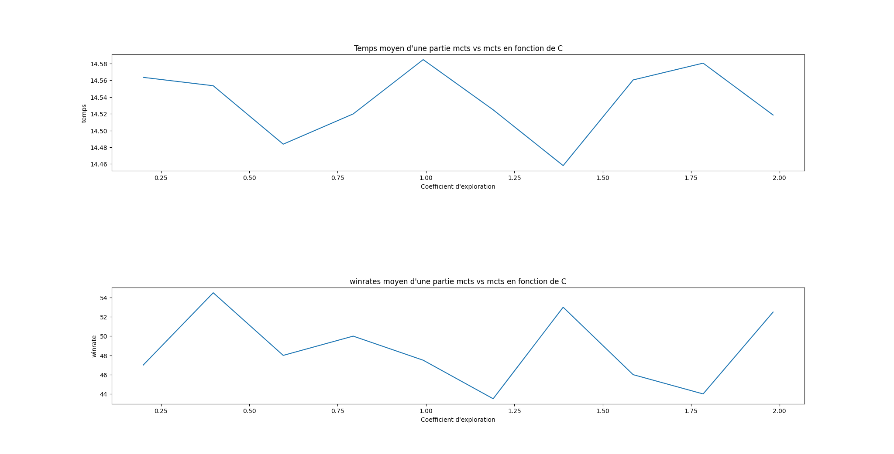

# AI-Jeux
Le projet est codé avec python 3.10.

# IA random

### IARand vs IARand (Non parallélisé)
    IARand0: 50.8953 
    IARand1: 49.1047
    time: 5.985922574996948
    nbsim/s: 167058.62587948857

### IA100P vs IARand
##### Non parallélisé
    IA100P: 100.0 
    IARand: 0.0
    time: 103.03537583351135
    nbsim/s: 9.705404497343123

##### Parallélisé
    IA100P: 100.0 
    IARand: 0.0
    time: 12.679893255233765
    nbsim/s: 78.8650172261694

### IA1KP vs IA100P
##### Non parallélisé
    IA1KP: 86.0 
    IA100P: 14.0
    time: 1064.7556960582733
    nbsim/s: 0.9391825784093019

##### Parallélisé
    IA1KP: 87.3 
    IA100P: 12.7
    time: 122.65228533744812
    nbsim/s: 8.153129778615552

### IA10KP vs IA1KP (parallelisé)
    IA10KP: 70.0 
    IA1KP: 30.0
    time: 1198.9328608512878
    nbsim/s: 0.8340750617928364

## MCTS

    Pour cette partie nous avons implémenté l'algorithme MCTS. Pour nous avons décidé de de fixer le nombre de simulation de l'algorithme de MC à 100. Comme condition de fin nous avons choisi une condtion temporelle.
    Notre algorithme de MCTS calcule un abre avec une constante d'esploration C=2 pendant l'exécution des cycles : sélection, exploration, simulation, remonté. Et pour sorti on utilise une contante C déterminer par l'utilisateur pour sélectionné les meileurs mouvements.

    Pour comprendre la diférérenc une constante d'exploration C faible ou forte, on a simulé plusieurs parties de jeu en faisant un combats MCTS contre MCTS, tout deux avec les même paramêtre. On a supossé qu'on aurais un ratio de victoire de 1/2.

    

    

